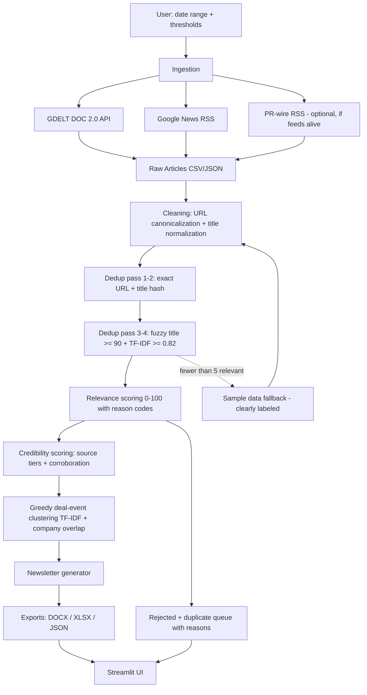

# DealLens FMCG

DealLens FMCG generates **FMCG DealBrief**, a Streamlit industry-intelligence newsletter for recent FMCG M&A and investment activity from public news. Most news-monitoring demos summarize individual articles. DealLens FMCG clusters articles into transaction events, so the user sees one evidence-backed deal item per event with corroborating sources and transparent confidence.

## Demo Link + GitHub Link

- Demo link: https://benoriassignment-7jukxihgx2v2nu97zfg3cs.streamlit.app/
- GitHub link: https://github.com/solpxlb/Benori_assignment

## Why Deal Clustering, Not Article Summarization

Business readers do not need five versions of the same acquisition headline. They need one deal event with the best headline, corroborating sources, confidence, and evidence. Clustering also makes uncertainty visible: a single-source item is useful, but a multi-source event with an official release and independent reporting deserves higher confidence.

## Source Strategy

Primary source is **GDELT DOC 2.0**, which provides broad public-web article discovery without API keys. Fallback source is **Google News RSS**, which improves demo resilience when GDELT is slow, rate-limited, or sparse. Corroboration comes from PR-wire and company-release style RSS feeds only where Phase 0 probing confirmed live feeds: PR Newswire consumer products/retail, GlobeNewswire M&A, and GlobeNewswire consumer products. Demo reliability is protected by a clearly-labeled synthetic sample fallback; when live data produces fewer than five included articles, sample mode replaces the live set entirely rather than mixing live and synthetic rows.

## Architecture



The same source is stored in [`docs/architecture.mmd`](docs/architecture.mmd).

## Pipeline Walkthrough

**Ingestion:** The app fetches from GDELT, Google News RSS, and the confirmed-live PR-wire RSS feeds. Every network call has a 10-second timeout and returns an empty DataFrame/list on failure instead of crashing the app.

**Cleaning:** Raw rows are normalized into a shared article schema. URLs are canonicalized by stripping fragments and tracking parameters, and titles are normalized by removing source suffixes and noise prefixes such as "BREAKING:".

**Deduplication:** Duplicate rows are flagged, retained, and shown in the Transparency tab. Canonical rows continue into scoring and clustering; duplicate rows remain available for audit and export.

**Relevance Scoring:** Every row receives a deterministic 0-100 score with reason codes. Scoring uses only title, snippet, source metadata, query family, and visible dates/values.

**Credibility Scoring:** Every row receives a credibility tier and score based on source identity and metadata completeness. Cluster credibility then adds corroboration signals across independent sources.

**Sample Fallback:** The fallback check happens after live rows are cleaned, deduped, and scored. If fewer than five canonical rows are classified as `include`, the live set is discarded and the sample set is processed from the beginning with `is_sample=True`.

**Clustering:** Canonical include/watchlist rows that pass the sidebar thresholds are greedily grouped into deal events using TF-IDF similarity, date windows, and extracted company overlap. One cluster represents one transaction event.

**Newsletter + Exports:** Cluster records feed the FMCG DealBrief markdown, DOCX, XLSX, clusters JSON, raw CSV, and raw JSON downloads. The newsletter uses deterministic templates and does not generate unsupported claims.

## Deduplication Logic

Deduplication runs in four passes:

1. Exact canonical URL match.
2. Exact normalized title match within 14 days.
3. Fuzzy title match using RapidFuzz token set ratio `>= 90` within 14 days.
4. TF-IDF cosine similarity `>= 0.82` within 14 days, mainly for snippet-bearing rows.

Duplicate rows are never deleted. Canonical selection prefers the better source tier, then the longer snippet, then the newer date. Duplicate rows are excluded from scoring aggregates and clustering, but remain visible in the Transparency tab and exports with `duplicate_of` and `dedupe_reason`.

## Relevance Scoring

| Signal | Points |
|---|---:|
| Strong deal term | +30 |
| Soft deal term | +20 |
| Direct FMCG/CPG term | +25 |
| Category term | +15 |
| Watchlist company | +15 |
| Recent <= 7d / <= 30d | +10 / +5 |
| Visible deal value | +10 |
| Targeted query context | +5 |
| Earnings noise | -25 |
| Launch noise | -10 |
| No deal term | capped at 30 |

Rows scoring `>= 70` are `include`, rows from `55` to `69` are `watchlist`, and lower rows are `reject`. Sidebar thresholds filter which rows enter clustering and display, but scoring still runs on all rows so rejected items remain explainable.

## Credibility Scoring

Article-level source tiers are:

| Tier | Base Score | Examples |
|---|---:|---|
| Tier 1 | 90 | Reuters, Bloomberg, Financial Times, Wall Street Journal, AP News, CNBC, BBC |
| Tier 2 | 75 | Food Dive, Just Food, Retail Dive, The Grocer, Economic Times, Mint, VCCircle |
| Tier 3 | 60 | PR Newswire, Business Wire, GlobeNewswire |
| Tier 4 | 45 | Unknown or unlisted sources |

Complete source/date metadata adds `+5`; missing published date subtracts `10`. Cluster credibility is:

```text
0.60 * max_article_credibility
+ 0.25 * average_top3_article_credibility
+ corroboration_bonus
```

The score is capped at 100. Corroboration adds `+10` for at least two independent sources, `+15` for at least three independent sources, and `+15` for a tier 1 plus tier 3 mix. A single-source cluster intentionally scores below its own article's credibility because one source is less certain than a corroborated deal event; corroboration earns that confidence back.

## Running Locally

```bash
git clone <public-github-url>
cd benori_assignment
python3.11 -m venv .venv && source .venv/bin/activate
pip install -r requirements.txt && streamlit run app.py
```

To run tests after installation:

```bash
python -m pytest -q
```

The app needs no API keys. With no internet or sparse live data, keep "Use sample fallback" enabled and run the pipeline.

## Outputs Produced

- Streamlit Snapshot & Newsletter tab with FMCG DealBrief.
- Deal Clusters tab with event-level evidence and source links.
- Data & Transparency tab with duplicates, rejects, processed rows, reason codes, and search.
- Methodology tab with architecture, deduplication, scoring, credibility, and limitations.
- Downloadable DOCX newsletter.
- Downloadable XLSX workbook.
- Downloadable clusters JSON.
- Downloadable raw CSV.
- Downloadable raw JSON.

## Assumptions & Limitations

- Free public sources have uneven recall, so some relevant FMCG deals will be missed.
- Heuristic relevance scoring favors explainability over perfect precision; false positives and false negatives are expected.
- Greedy clustering is order-dependent and compares articles to cluster seed rows, so borderline events can split or merge incorrectly.
- The app uses headlines, RSS snippets, and metadata only; it does not scrape full articles, bypass paywalls, or infer facts that are not visible in fetched text.
- Deal values, company names, geographies, and dates are extracted only from visible text. Unknown values are shown as `undisclosed` or `Not specified`.
- English-language source bias is intentional for this demo and excludes non-English coverage.
- Google News RSS links hide publisher domains, so credibility lookup falls back to source names for those rows.
- Sample data is synthetic and visibly labeled; it exists for offline demo reliability, not as evidence of live market activity.

## Future Enhancements

- Add richer licensed or free connectors such as NewsAPI or Event Registry for better recall.
- Add optional LLM-assisted relevance review as a second layer, with citations and deterministic fallbacks.
- Replace TF-IDF near-duplicate detection with embedding-based deduplication for stronger semantic matching.
- Add entity resolution for company names, brands, subsidiaries, and acquirers.
- Add scheduled runs, historical storage, and weekly email delivery.
- Add reviewer feedback loops to tune scoring thresholds from accepted/rejected examples.
