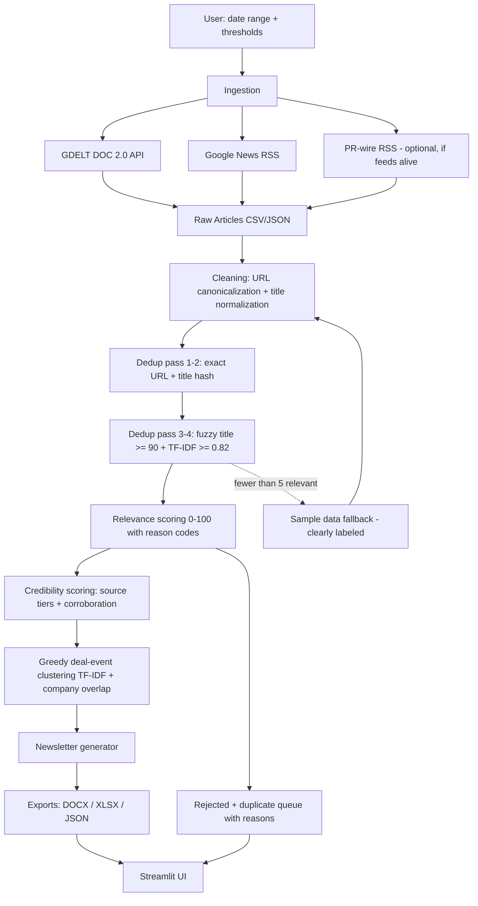

# DealLens FMCG — Execution Plan

A multi-phase build plan for a take-home assignment. Feed phases to Claude Code / Codex **one at a time**, in order. Each phase has: goal, files to create, exact behavior spec, and acceptance checks. Do not start a phase until the previous phase's acceptance checks pass.

**Naming:** app = **DealLens FMCG**; the newsletter it produces = **FMCG DealBrief**. Repo name `fmcg-dealbrief` is fine.

**Product in one sentence:** DealLens FMCG converts noisy public news coverage into deal-event clusters, so a business user can skim recent FMCG M&A and investment activity with source evidence, relevance scoring, and credibility signals — it does not summarize 20 articles, it identifies the 5 deal events behind them.

**Global rules (apply to every phase):**
- Python 3.11. No paid APIs, no API keys required to run.
- Every function that touches the network must fail gracefully (try/except, return empty list/DataFrame, log a warning). The app must never crash because a source is down.
- No hallucination: deal values, companies, geographies come only from visible text. Unknown → "undisclosed" / "not specified".
- Typed function signatures + docstrings on all public functions.
- Keep scoring weights as named constants at the top of their module so they're easy to inspect and defend.

---

## Phase 0 — Scaffold & de-risk (30–45 min)

**Goal:** repo skeleton + confirm live data sources actually return usable data before building on them.

**Create:**
```
fmcg-dealbrief/
├── app.py                  # placeholder: st.title only
├── README.md               # placeholder
├── requirements.txt
├── .gitignore              # outputs/*, .env, __pycache__, .venv
├── docs/architecture.mmd   # placeholder
├── data/                   # empty for now
├── outputs/.gitkeep
├── src/__init__.py
├── src/config.py           # empty constants for now
└── tests/__init__.py
```

**requirements.txt:**
```
streamlit
pandas
requests
feedparser
rapidfuzz
scikit-learn
tldextract
pyyaml
python-docx
XlsxWriter
pytest
```

**De-risk script (`scripts/probe_sources.py`, throwaway):**
1. Hit GDELT DOC 2.0: `https://api.gdeltproject.org/api/v2/doc/doc` with params `query='("acquisition" OR "merger" OR "stake") (FMCG OR "consumer goods" OR food OR beverage)'`, `mode=artlist`, `format=json`, `maxrecords=50`, `timespan=7d`, `sort=datedesc`. Print count + first 5 titles.
2. Hit Google News RSS: `https://news.google.com/rss/search?q=FMCG+acquisition&hl=en-US&gl=US&ceid=US:en` via feedparser. Print count + first 5 titles.
3. Probe PR-wire RSS feeds (prnewswire / businesswire / globenewswire — find their current M&A or consumer-products category feed URLs). These break and move often; record which (if any) return live entries. **Decision rule: only build the rss_feeds connector in Phase 2 for feeds confirmed alive here. Dead feeds → README mention only.**
4. Record findings as a comment block: typical article counts, JSON shape quirks (GDELT sometimes returns non-JSON on error, articles under `articles` key), date formats seen (GDELT `seendate` is `YYYYMMDDTHHMMSSZ`).

**Acceptance:**
- [ ] `pip install -r requirements.txt` succeeds
- [ ] probe script prints real titles from both sources (or documents exactly how they fail)
- [ ] repo structure exists, `streamlit run app.py` shows the placeholder

---

## Phase 1 — Config, queries, data model (45 min)

**Goal:** all constants, term lists, and the article schema in one place.

**Create `src/config.py`:**

Term lists (copy verbatim):
```python
FMCG_TERMS = ["FMCG", "CPG", "consumer packaged goods", "fast moving consumer goods",
              "consumer goods", "consumer brands", "packaged goods"]

CATEGORY_TERMS = ["food", "beverage", "dairy", "snacks", "confectionery", "packaged foods",
                  "frozen foods", "nutrition", "beauty", "cosmetics", "skincare",
                  "personal care", "home care", "household products", "hygiene",
                  "cleaning products", "pet food", "baby care"]

STRONG_DEAL_TERMS = ["acquisition", "acquires", "acquired", "merger", "merges",
                     "buyout", "takeover", "joint venture", "stake sale", "divestment"]

SOFT_DEAL_TERMS = ["investment", "strategic investment", "minority stake", "majority stake",
                   "stake", "funding", "raises", "private equity"]

COMPANY_WATCHLIST = ["Unilever", "Nestlé", "Nestle", "Procter & Gamble", "P&G", "PepsiCo",
                     "Coca-Cola", "Mondelez", "Mars", "Danone", "Kraft Heinz", "General Mills",
                     "Kellanova", "Colgate-Palmolive", "Reckitt", "L'Oréal", "L'Oreal",
                     "Kimberly-Clark", "Henkel", "Tata Consumer", "Hindustan Unilever",
                     "Dabur", "Marico", "Godrej Consumer", "ITC", "Britannia", "Emami"]

NEGATIVE_TERMS = ["earnings", "stock price", "share buyback", "dividend", "quarterly results",
                  "product launch", "marketing campaign", "crypto", "ETF", "real estate"]
```

Query families (5, each a GDELT-syntax string AND a plain-text variant for RSS):
1. General: deal terms × FMCG terms
2. Food & beverage: deal terms × (food, beverage, dairy, snacks)
3. Beauty & personal care: deal terms × (beauty, cosmetics, skincare, personal care)
4. PE/funding: (private equity, funding, raises) × (consumer brand, FMCG, CPG)
5. Watchlist: top ~10 companies × deal terms

Also: `GDELT_TIMEOUT=10`, `MAX_RECORDS_PER_QUERY=75`, dedupe/cluster thresholds (defined in later phases but declared here), score classification cutoffs `INCLUDE=70, WATCHLIST=55`.

**Create `src/models.py`:** a plain `dataclass` (not pydantic) `Article` with fields:
`article_id, title, snippet, url, canonical_url, source_name, domain, published_at, retrieved_at, source_api, query, is_sample, normalized_title, duplicate_of, dedupe_status, dedupe_reason, relevance_score, relevance_reasons, credibility_score, credibility_tier, cluster_id, status`
plus `to_dict()`. In practice the pipeline operates on a pandas DataFrame with these columns; the dataclass documents the schema.

**Acceptance:**
- [ ] `from src.config import *` works, all lists non-empty
- [ ] query builder produces 5 valid GDELT query strings (parenthesized OR groups, quoted phrases)

---

## Phase 2 — Ingestion (1.5 h)

**Goal:** `src/sources/` package — three connectors, each its own module, returning DataFrames matching the schema.

```
src/sources/__init__.py      # exports fetch_all
src/sources/gdelt.py         # primary
src/sources/google_news.py   # fallback
src/sources/rss_feeds.py     # optional PR-wire corroboration, non-fatal
```

**`fetch_gdelt(queries: list[str], timespan: str = "7d", max_records: int = 75) -> pd.DataFrame`:**
- One GET per query to the DOC 2.0 endpoint, params as in Phase 0.
- Parse defensively: response may be non-JSON (return empty for that query), articles under `articles` key, fields of interest: `title`, `url`, `seendate`, `domain`, `language`, `sourcecountry`.
- Parse `seendate` format `YYYYMMDDTHHMMSSZ` → UTC datetime.
- Set `source_api="gdelt"`, `snippet=""` (GDELT artlist gives no snippet), `retrieved_at=now`, `is_sample=False`, record originating `query`.
- Sleep 0.5s between queries (be polite).

**`fetch_google_news(queries: list[str], max_per_query: int = 50) -> pd.DataFrame`:**
- URL-encode each plain-text query into the RSS search URL.
- feedparser; extract `title`, `link`, `published_parsed` → datetime, `source.title` if present else "Google News", `summary` → snippet (strip HTML).
- Note: Google News links are redirect URLs; keep as-is, domain extraction handles `news.google.com` → treat the `source.title` as the real source name for credibility lookup (Phase 5 must support name-based tier matching, not just domain).
- Set `source_api="google_news_rss"`.

**`fetch_rss_feeds(feeds: list[dict]) -> pd.DataFrame` (optional, build only if Phase 0 probe showed live feeds):**
- `feeds` from config: `[{url, source_label}, ...]` for PR Newswire / Business Wire / GlobeNewswire M&A or consumer-products category feeds — use whichever URLs the Phase 0 probe confirmed alive; if none were alive, skip this module entirely and cover PR wires in the README source-strategy section instead.
- feedparser per feed, any failure → skip that feed silently, log warning. `source_api="pr_wire_rss"`. These rows are official/promotional sources — tier 3 by design, valuable for corroboration (+15 official+independent bonus), not as standalone evidence.

**`fetch_all(timespan: str) -> pd.DataFrame`:** runs gdelt + google news (+ pr wires if implemented), concatenates, assigns `article_id` (uuid4 hex[:12]), drops rows with empty title or url.

**Acceptance:**
- [ ] live run returns a combined DataFrame with >0 rows and correct columns
- [ ] killing the network (or bad URL) returns empty DataFrame, no exception
- [ ] dates are timezone-aware UTC datetimes

---

## Phase 3 — Cleaning & sample data (1 h)

**Goal:** `src/cleaning.py` + `data/sample_articles.csv`.

**`canonicalize_url(url) -> str`:** lowercase scheme+host, strip `www.`, drop fragment, drop trailing slash, remove tracking params (`utm_*, fbclid, gclid, msclkid, cmpid, ref, source, output`), sort remaining params.

**`normalize_title(title) -> str`:** lowercase → strip suffix after last `" - "` or `" | "` only if suffix is short (<35 chars, likely a source name) → remove punctuation → remove noise words (`breaking, update, exclusive, latest, report, says`) → collapse whitespace.

**`extract_domain(url) -> str`:** tldextract, return `domain.suffix`.

**`clean_snippet(text) -> str`:** strip HTML tags (regex or html.parser), collapse whitespace, truncate 500 chars.

**`apply_cleaning(df) -> df`:** adds `canonical_url, normalized_title, domain` columns; coerces dates; fills missing snippets with "".

**`data/sample_articles.csv` — 14 synthetic rows, fake companies, example.com URLs, `is_sample=True`:**
- 3 articles, same fake acquisition ("Example Foods acquires Sample Snacks Co"), different fake domains, slightly different titles → should cluster together
- 2 articles, same fake funding round ("Demo Beauty Brands raises $40M") → second cluster
- 1 JV article ("Sample Beverage Co and Demo Dairy form joint venture")
- 1 PR-wire-style article (domain prnewswire.example.com)
- 1 near-duplicate of article #1 (same story, utm params on URL, "BREAKING:" prefix on title) → must be caught by dedup
- 1 exact URL duplicate of article #4
- 2 irrelevant articles (one earnings report, one product launch) → must be rejected
- 1 watchlist-grade article (vague "Example Foods reportedly exploring sale of dairy unit")
- 1 non-FMCG deal (fake bank merger) → rejected
- Dates spread across the last 14 days relative to a `published_at` column the loader shifts to "now minus N days" so the sample never goes stale. Implement `load_sample() -> pd.DataFrame` in cleaning.py or a small `src/sample.py` that does this date shifting.

**Acceptance:**
- [ ] `canonicalize_url("https://www.Site.com/a/?utm_source=x&b=2&a=1#frag")` → `https://site.com/a?a=1&b=2`
- [ ] near-dupe sample titles normalize to identical strings
- [ ] `load_sample()` returns 14 rows with fresh dates and `is_sample=True`

---

## Phase 4 — Deduplication (1 h)

**Goal:** `src/dedupe.py`, four passes (the 4th optional), transparent reasons, duplicates retained not deleted.

**`dedupe(df) -> df`** adds `duplicate_of, dedupe_status ("canonical"|"duplicate"), dedupe_reason`:

1. **Exact URL:** group by hash of `canonical_url`. Reason: `"exact_url"`.
2. **Exact title:** group by hash of `normalized_title` where published dates within 14 days. Reason: `"exact_title_14d"`.
3. **Fuzzy title:** pairwise `rapidfuzz.fuzz.token_set_ratio` on `normalized_title` for remaining canonicals; duplicate if ratio ≥ 90 and dates within 14 days. To keep it O(n·k) not O(n²) at scale, only compare within blocks sharing any 2 title tokens — but with <500 articles, plain pairwise is acceptable; implement plain pairwise with a comment acknowledging this. Reason: `"fuzzy_title_90"`.
4. **TF-IDF near-duplicate (optional 4th pass):** vectorize `normalized_title + " " + snippet`; duplicate if cosine ≥ 0.82 and dates within 14 days. Reason: `"tfidf_similarity_82"`. **Honest caveat (put in code comment):** GDELT artlist rows have no snippets, so for them this pass runs on title-only and adds little beyond fuzzy matching — its value is on snippet-bearing rows (Google News, PR wires) and as a second, independent near-dup method. If it causes false merges on short titles, raise to 0.85 rather than debugging.

**Canonical selection within a dupe group:** prefer (a) higher credibility tier domain — use a lightweight tier lookup, full credibility comes in Phase 5; do it by calling the tier-lookup function which Phase 5 will own, so for this phase stub `get_tier(domain) -> int` reading `data/credibility_tiers.yaml` (create the YAML now, Phase 5 reuses it), then (b) longer snippet, then (c) newer date.

**`data/credibility_tiers.yaml`:**
```yaml
tier_1:  # base 90
  domains: [reuters.com, bloomberg.com, ft.com, wsj.com, apnews.com, cnbc.com, bbc.com, nikkei.com]
  names: [Reuters, Bloomberg, Financial Times, Wall Street Journal, AP News, CNBC, BBC]
tier_2:  # base 75
  domains: [fooddive.com, just-food.com, foodbev.com, cosmeticsdesign.com, beveragedaily.com,
            retaildive.com, thegrocer.co.uk, economictimes.indiatimes.com, vccircle.com,
            dealstreetasia.com, agfundernews.com, livemint.com, business-standard.com]
  names: [Food Dive, Just Food, Retail Dive, The Grocer, Economic Times, Mint, VCCircle, DealStreetAsia]
tier_3:  # base 60
  domains: [prnewswire.com, businesswire.com, globenewswire.com]
  names: [PR Newswire, Business Wire, GlobeNewswire]
default_tier: 4  # base 45
```
(name lists exist because Google News RSS hides the real domain — match on source_name case-insensitively as fallback.)

**Acceptance:**
- [ ] sample data: the utm-variant and the exact-URL dupe are both flagged with correct reasons
- [ ] "BREAKING:" fuzzy variant flagged as `fuzzy_title_90` or `exact_title_14d`
- [ ] canonical row in each group is the best-tier/longest-snippet one
- [ ] zero rows deleted; `dedupe_status` partitions the frame cleanly

---

## Phase 5 — Relevance & credibility scoring (1.5 h)

**Goal:** `src/scoring.py`. Weights as module-level constants. Every score returns reason codes.

**`score_relevance(row) -> tuple[int, list[str]]`** — 0–100, additive, capped:
| signal | points | reason code |
|---|---|---|
| strong deal term in title/snippet | +30 | `strong_deal_term` |
| soft deal term (if no strong) | +20 | `soft_deal_term` |
| direct FMCG/CPG term | +25 | `fmcg_term` |
| category term (if no direct, max one bucket) | +15 | `category_term` |
| watchlist company match | +15 | `watchlist_company` |
| published ≤7d | +10 | `recent_7d` |
| published 8–30d | +5 | `recent_30d` |
| deal value visible (regex: `[$€£₹]\s?\d`, `\d+\s?(million|billion|crore|mn|bn)`, `USD|INR|EUR`) | +10 | `deal_value_visible` |
| returned by a tightly-targeted query family (e.g. "F&B acquisition", "FMCG private equity") — compensates for GDELT's missing snippets | +5 | `source_query_context` |
| **penalty:** negative term (earnings/stock/buyback/dividend) and no strong deal term | −25 | `earnings_noise` |
| **penalty:** product launch / marketing term and no deal term | −10 | `launch_noise` |
| **hard rule:** no deal term at all → score capped at 30 | — | `no_deal_term` |

**Classification:** ≥70 `include`, 55–69 `watchlist`, <55 `reject`. Store as `status`.

**`get_tier(domain, source_name) -> tuple[int, int]`** (tier, base score) from the YAML — domain match first, then case-insensitive name match, else default. Cache YAML load.

**`score_credibility(row) -> tuple[int, str, list[str]]`:** base from tier; +5 if both date and source name present; −10 if no published date; clamp 0–100. Tier label `"tier_1"`..`"tier_4"`.

**Cluster credibility (function lives here, called in Phase 6):**
```
cluster_credibility = 0.60 * max_article_credibility
                    + 0.25 * average_top_3_article_credibility
                    + corroboration_bonus
```
bonus = +10 if ≥2 independent domains, +15 if ≥3, +15 if a tier_1 source AND a tier_3 PR source corroborate (official + independent). Cap 100.
**Known quirk (document in methodology, it's intentional):** a single-source cluster scores below its own article's credibility (e.g. lone Reuters 90 → 0.6·90 + 0.25·90 ≈ 76). That's the design: one source = less certain than that source is credible. Corroboration is what earns the score back.

**Confidence label:**
- High: relevance ≥ 75 AND credibility ≥ 75 AND (≥2 independent domains OR a tier_1 source)
- Medium: relevance ≥ 65 AND credibility ≥ 60
- Low: otherwise

**Acceptance:**
- [ ] sample acquisition article scores ≥70 with reasons `[strong_deal_term, fmcg_term/category_term, ...]`
- [ ] sample earnings article scores <55 with `earnings_noise`
- [ ] bank-merger article rejected (deal term present but no FMCG/category signal keeps it under 70 — verify; if it sneaks through, add a "no FMCG signal → cap 50" rule and document it)
- [ ] reuters.com → tier 1 / 90; unknownblog.net → tier 4 / 45; source_name "Reuters" with google domain → tier 1

---

## Phase 6 — Deal clustering (1.5 h)

**Goal:** `src/clustering.py`. Greedy single-pass clustering of `include` + `watchlist` canonical articles into deal events.

**Algorithm:**
1. Take canonical articles with status include/watchlist, sorted by `published_at` desc.
2. TF-IDF vectorize `normalized_title + " " + snippet` (sklearn, `min_df=1`, english stopwords).
3. Extract companies per article: match COMPANY_WATCHLIST (case-insensitive, accent-insensitive for Nestlé) + capitalized phrases of 1–3 tokens from the raw title (regex `\b[A-Z][a-zA-Z&'.-]+(?:\s[A-Z][a-zA-Z&'.-]+){0,2}\b`), filtered against a stoplist of generic words (The, This, Why, How, month names, etc.).
4. Walk articles in order. For each, compare to existing clusters (against the cluster's first/seed article): join cluster if **dates within 30 days AND** (cosine ≥ 0.6 **OR** (≥1 shared extracted company AND cosine ≥ 0.4)). Else start new cluster.
5. One pass, no merging of clusters afterwards. Comment in code: "greedy is order-dependent; acceptable at this scale, documented in limitations."

**Cluster record derivation:**
- `canonical_headline`: title of highest (credibility, then relevance) article
- `deal_type`: first match in priority order — merger > acquisition > joint venture > divestment > stake > funding > investment > unknown
- `companies`: union of extracted companies, max 5, else "Not clearly identified"
- `geography`: scan title+snippet for country/region terms (India, US, UK, Europe, China, Japan, Brazil, Global...) else GDELT sourcecountry of best article, else "Not specified"
- `category`: first CATEGORY_TERMS match across cluster text, mapped to display buckets (Food & Beverage, Beauty & Personal Care, Household & Home Care, Dairy, Snacks & Packaged Foods, Other)
- `deal_value`: regex extraction (same as Phase 5) returning the matched string verbatim, else "undisclosed"
- `relevance_score`: max across cluster; `credibility_score`: cluster credibility from Phase 5; `confidence`: from Phase 5 rule
- `why_it_matters`: deterministic template, evidence-bounded:
  `"Signals {deal_type} activity in {category}{', involving ' + companies if identified}{' in ' + geography if specified}. {N} source(s) reporting{', value ' + deal_value if not undisclosed}."`
- `sources`: list of `{title, url, domain, published_at, credibility_tier}`
- `article_count, source_count (unique domains), earliest/latest published_at`

**Acceptance:**
- [ ] sample data produces: 1 acquisition cluster with 3 articles (post-dedup may be 2 — verify expectation against your sample construction), 1 funding cluster with 2, 1 JV cluster with 1
- [ ] no cluster mixes the acquisition and the funding stories
- [ ] deal_value extracted for the $40M funding sample, "undisclosed" elsewhere
- [ ] why_it_matters contains zero information not derivable from the inputs

---

## Phase 7 — Newsletter & exports (1.5 h)

**Goal:** `src/newsletter.py` + `src/exports.py`.

**Newsletter (markdown string + structured dict):**
1. **Header:** "FMCG DealBrief" + date range + run timestamp + data-mode badge (LIVE / SAMPLE DATA — never omit this)
2. **Executive snapshot:** N deal events from M articles across K sources; counts by confidence; top 3 categories; 1-line auto-summary ("Activity concentrated in {top category}, led by {top deal headline}.")
3. **Top deal highlights:** clusters with confidence High/Medium, sorted by (confidence, relevance, credibility, recency). Each item: bold headline, one metadata line (type · companies · geography · value · confidence · rel/cred scores · N sources), why-it-matters, source links.
4. **Watchlist:** low-confidence/watchlist clusters, compact one-liners.
5. **Methodology note:** 4 sentences — sources, dedup, scoring, no-hallucination policy.
6. **Source appendix:** all cited URLs.

**`src/exports.py`:**
- `raw_articles.csv` + `.json` (pre-dedup, everything fetched)
- `processed_articles.csv` + `.json` (with all scoring/dedup columns)
- `deal_clusters.json`
- `newsletter.docx` (python-docx: heading styles, bold headlines, hyperlinks as plain URLs is fine)
- `newsletter.xlsx` (XlsxWriter, 7 sheets — this is the deliverable a research-firm reviewer judges by feel, make it consulting-grade: **Executive Snapshot, Deal Highlights, Deal Clusters, Article Evidence, Watchlist, Rejected & Duplicates** (with reason codes), **Methodology**; header formatting, frozen top row, sensible column widths, autofilters on data sheets)
- All functions take data + output dir, return file paths. Also return bytes/BytesIO so Streamlit download buttons don't need disk reads.

**Acceptance:**
- [ ] markdown newsletter renders cleanly in Streamlit
- [ ] docx opens in Word/Pages with correct headings
- [ ] xlsx opens with 4 populated sheets
- [ ] sample-data run shows SAMPLE DATA badge in newsletter header and docx

---

## Phase 8 — Streamlit app (2 h)

**Goal:** `app.py` wiring everything, plus `src/pipeline.py` as the single orchestration entrypoint.

**`src/pipeline.py`:** `run_pipeline(timespan, min_relevance, min_credibility, use_sample_fallback) -> PipelineResult` (dict/dataclass with raw_df, processed_df, clusters, newsletter_md, export_bytes, run_metadata).

**Pipeline order (exact — the fallback check happens POST-scoring; you cannot count includes before scoring):**
```
fetch live raw
→ clean → dedupe → score (relevance + credibility)
→ count canonical rows with status == "include"
→ if count < 5 AND fallback enabled:
      discard live data entirely (never mix live + sample)
      load sample → clean → dedupe → score
→ apply sidebar thresholds (display/clustering filter only — scores already computed on everything)
→ cluster → newsletter → exports
``` Wrap fetch in `st.cache_data(ttl=1800)`-compatible function (cache the fetch, not the whole pipeline, so slider changes re-score without re-fetching).

**Sidebar:** date range select (24h / 7d / 30d → GDELT timespan strings), min relevance slider (0–100, default 60), min credibility slider (default 50), "use sample fallback" checkbox (default on), Run Pipeline button. Show a warning banner when sample data is in use.

**Tabs:**
1. **📰 Snapshot & Newsletter** — metric row at the very top (deal events, articles, dupes removed, high-confidence — the evaluator must see value in 10 seconds), rendered newsletter below, 4 download buttons (DOCX, XLSX, clusters JSON, raw CSV).
2. **🔍 Deal Clusters** — `st.expander` per cluster: metadata, why-it-matters, evidence table (`st.dataframe` with `LinkColumn` for URLs).
3. **🧹 Data & Transparency** — three sections: duplicates table (title, duplicate_of, dedupe_reason), rejected table (title, score, relevance_reasons), full processed dataframe with a text search filter. This tab is the live demonstration of dedup/relevance logic — the thing the assignment explicitly grades.
4. **📖 Methodology** — the mermaid diagram source in a code block + rendered explanation of dedup passes, scoring table, credibility tiers, limitations (greedy clustering order-dependence, free-source recall limits, heuristic misclassification, no full-article scraping).

**Acceptance:**
- [ ] `streamlit run app.py`, no keys, no internet → sample mode works end to end
- [ ] with internet → live data flows through, all tabs populate
- [ ] moving sliders changes cluster count without re-fetching (cache works)
- [ ] downloads produce valid files

---

## Phase 9 — Tests (1 h)

**Goal:** `tests/test_pipeline.py` — small, fast, no network. ~10 tests:

1. `canonicalize_url` strips utm params + fragment + www, sorts params
2. `normalize_title` makes "BREAKING: X Acquires Y - Reuters" ≡ "X acquires Y"
3. exact URL dupes flagged
4. fuzzy title dupes flagged at ≥90, not flagged at <90 (construct both)
5. clear acquisition article → status include
6. earnings article → status reject with `earnings_noise` reason
7. no-deal-term article capped ≤30
8. tier lookup: reuters.com→tier1, unknown→tier4, name-based "Reuters"→tier1
9. clustering groups two same-deal articles, separates a different deal
10. sample loader returns 14 rows, fresh dates, is_sample=True

**Acceptance:** `pytest -q` green in <10s.

---

## Phase 10 — README, diagram, deploy (1.5 h)

**README.md sections, in order:** title + one-paragraph pitch (use the positioning line: *"Most news-monitoring demos summarize individual articles. DealLens FMCG clusters articles into transaction events, so the user sees one evidence-backed deal item per event with corroborating sources and transparent confidence."*) · demo link + GitHub link (placeholders) · why deal clustering not article summarization (3 sentences) · **source strategy** (primary: GDELT DOC 2.0; fallback: Google News RSS; corroboration: PR wires / company releases where feeds are live; demo reliability: clearly-labeled synthetic sample fallback) · architecture (embed the mermaid below) · pipeline walkthrough (one short paragraph per stage) · deduplication logic (the 4 passes, thresholds, canonical selection) · relevance scoring (the weights table from Phase 5, verbatim) · credibility scoring (tiers + weighted cluster formula + corroboration, including the single-source quirk and why it's intentional) · running locally (4 commands) · outputs produced · **assumptions & limitations** (be specific and honest — this section earns trust: free-source recall, heuristic precision, greedy clustering, headline-only analysis no full-text scraping, English-language bias) · future enhancements (NewsAPI/Event Registry connectors, LLM-assisted relevance as optional layer, embedding dedup, entity resolution, scheduled runs — show you know what the "real" version adds).

**`docs/architecture.mmd`:**


**Deploy:** push to GitHub (public), deploy on Streamlit Community Cloud (free, no card). Verify the deployed app cold-starts and runs sample mode if GDELT is slow. Put both links in README and in the submission email.

**Final acceptance (the assignment's own criteria):**
- [ ] demo link works in incognito
- [ ] GitHub repo: README, diagram, tests, no secrets
- [ ] raw data CSV/JSON downloadable
- [ ] newsletter in DOCX + XLSX
- [ ] dedup + relevance logic explained in README and visible live in the Transparency tab
- [ ] a non-technical reader can skim the newsletter tab and understand FMCG deal activity in under 2 minutes

---

## Suggested 3-day schedule

| Day | Phases | Outcome |
|---|---|---|
| 1 | 0–5 | scored, deduped articles from live + sample data, as a script |
| 2 | 6–8 | full app running end to end locally |
| 3 | 9–10 + buffer | tests, README, deploy, polish, dry-run the demo |

## Notes for driving Claude Code / Codex

- Paste the **Global rules** block + one phase at a time. After each phase, run its acceptance checks yourself before continuing — don't let the agent self-certify.
- If the agent wants to add pydantic, async, retries-with-backoff, or an LLM call: decline. Scope is the feature.
- Phase 0's probe findings should inform Phase 2 — if GDELT returned garbage in your region/window, tell the agent explicitly what shapes you saw.
- Commit after every phase. If a phase goes sideways, `git checkout .` and re-prompt is cheaper than untangling.